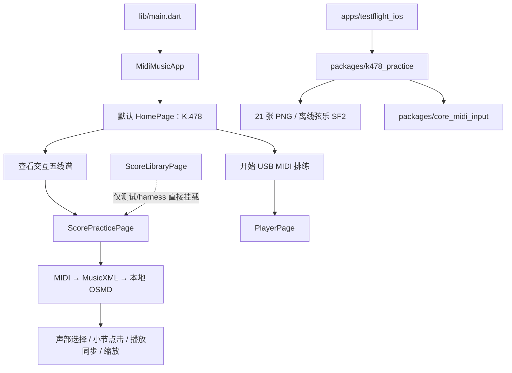

# 2026-09-04 将 LIAB `main` 合入本地交互五线谱分支的记录

## 1. 记录摘要

| 项目 | 内容 |
| --- | --- |
| 合并日期 | 2026-09-04 |
| 本地分支 | `feature/interactive-musicxml-score` |
| 合并提交 | `222aa3cb74913f207cc69279d55b0fa93c9f4d57` |
| 第一父提交 | `8c37ab309564259577ca3d58b43e1a1c2bd25340`（交互五线谱分支） |
| 第二父提交 | `98ae3c30f3b44eae8b6de17f88a1d9e14d7ec17f`（LIAB `main`） |
| 共同基线 | `23b50d26484a9ec9cb50d1d66b977da06d8af6d9` |
| 合并方式 | 本地 `--no-ff` 双父 merge commit，人工解决冲突 |
| 远程状态 | 合并完成时尚未 push；GitHub Actions 尚未运行本提交 |

本次合并把 LIAB 主线的 K.478 USB MIDI 排练能力、独立 TestFlight 候选工程，
与交互五线谱分支的 MIDI 自动记谱、MusicXML/OSMD、小节点击、声部选择和缩放
能力放入同一仓库。最终没有恢复 LIAB 主线中旧的练习谱面实现：根 App 的
`ScorePracticePage` 继续使用交互五线谱。

> 本文是合并完成时的状态快照。它记录的是 LIAB `main` 被合入本地
> `feature/interactive-musicxml-score`，不表示该结果已进入远程 `main`。

相对合并前的交互谱分支，本次合并结果涉及 172 个文件，新增 11,466 行、删除
1,352 行；其中包含独立候选工程、资源、测试、CI 和文档，不能把文件数量理解为
根 App 单一功能的改动规模。

## 2. 合并目标与非目标

### 2.1 目标

1. 保留 LIAB 主线的 K.478 专用首页和 USB MIDI 排练入口。
2. 让 K.478 从同一首页进入新的交互五线谱，而不是旧 PDF/钢琴卷帘练习页。
3. 保留交互谱分支已有的 MIDI→MusicXML→本地 OSMD、声部组合、默认选择、
   小节跳转、播放同步与缩放能力。
4. 保留 LIAB 的独立 iOS TestFlight 候选，且不让它和根 App 的资产、测试及
   发布证据相互替代。
5. 解决代码、测试、CI 和文档之间的合并冲突，并建立可重复的质量门禁。

### 2.2 非目标

- 本次合并不代表根 App 或独立候选已经获得分发批准。
- 不把非默认通用曲库重新接回生产首页。
- 不把 PDF/PNG 或钢琴卷帘恢复为根 `ScorePracticePage` 的主视图。
- 不把 OMR 纳入当前默认试用范围。
- 不以无签名构建、模拟器或自动化结果替代真实 iPhone、签名 IPA 和隐私报告。

## 3. 关键冲突与最终取舍

### 3.1 五个核心生产代码冲突

| 文件 | 处理方式 | 最终行为 |
| --- | --- | --- |
| `lib/core/notation/midi_notation_service.dart` | 保留交互谱分支版本 | 继续使用可取消 isolate、错误终态和完整记谱流程 |
| `lib/core/notation/midi_to_musicxml_converter.dart` | 保留交互谱分支版本 | 保留真实小节、量化、钢琴双谱表、voice 和 tie 处理 |
| `lib/core/score/score_playback_coordinator.dart` | 融合双方 | 保留小节命中、自动跟随、串行高亮与重试，同时改用窄端口依赖 |
| `lib/ui/pages/home_page.dart` | 以 LIAB K.478 首页为底融合 | 保留 USB MIDI 入口，把谱面入口改接新 `ScorePracticePage` |
| `lib/ui/pages/score_practice_page.dart` | 以交互谱分支为主体 | 拒绝恢复旧 PDF/钢琴卷帘主视图，只融合返回标题、导入开关和播放端口适配 |

`settings_page.dart` 双方也都有改动，但可自动合并，不属于上述五个
核心内容冲突。

### 3.2 其他架构与产品取舍

| 冲突区域 | 最终结果 | 原因 |
| --- | --- | --- |
| 通用曲库与文件导入 | 原页面重命名为 `ScoreLibraryPage`，保存在 `home_page_legacy.dart`，不接默认导航 | 保留开发与后续能力，避免扩大当前试用范围 |
| USB MIDI 演奏台 | 保留 `PlayerPage` 及 LIAB 的 CoreMIDI/跟随改动 | 它是首页第二个独立入口，不与交互谱互相覆盖 |
| 播放器与谱面协调器 | 新增 `ScorePlaybackPort`、`ScoreRendererPort` 和 `MidiPlayerScorePlaybackAdapter` | 让谱面协调器依赖窄接口，同时继续复用现有 `MidiPlayerController` |
| 独立 TestFlight 候选 | 保留 `apps/testflight_ios`、`packages/k478_practice`、`packages/core_midi_input` | 候选使用静态 21 页 PNG 和离线 SF2，必须与根 OSMD App 分开验收 |
| OMR | 保留 MusicXML 原文直接进入 OSMD，并用同源解析结果驱动播放 | 避免退回只生成 MIDI、丢失可显示谱面语义的旧路径 |
| 文档与发布清单 | 按“根 App”和“独立候选”拆分事实与门槛；8 月材料标为历史快照 | 防止旧审查结论、旧测试数和当前发布状态混用 |

关键实现位置：

- 根默认首页：[lib/ui/pages/home_page.dart](../../lib/ui/pages/home_page.dart)
- 交互谱面页：[lib/ui/pages/score_practice_page.dart](../../lib/ui/pages/score_practice_page.dart)
- 非默认通用曲库：[lib/ui/pages/home_page_legacy.dart](../../lib/ui/pages/home_page_legacy.dart)
- USB MIDI 演奏台：[lib/ui/pages/player_page.dart](../../lib/ui/pages/player_page.dart)
- 播放适配器：[lib/core/score/midi_player_score_playback_adapter.dart](../../lib/core/score/midi_player_score_playback_adapter.dart)
- 谱面协调器：[lib/core/score/score_playback_coordinator.dart](../../lib/core/score/score_playback_coordinator.dart)

## 4. 合并后的入口与边界



需要特别区分以下两个目标：

1. **根 App**：默认 K.478 双入口；交互谱使用本地 OSMD；支持现有通用播放器和
   开发曲库，但通用曲库目前没有生产导航、深链或调试路由，只由
   测试/harness 直接挂载。
2. **独立 TestFlight 候选**：iPhone-only 的固定 K.478 验证包；仍使用 21 张
   静态 PNG 分谱与随包弦乐 SF2，不复用根 App 的交互谱发布证据。

当前产品边界以 [release_scope.md](../product/release_scope.md) 为准；能力证据以
[capability_matrix.md](../product/capability_matrix.md) 为准。

## 5. CI 与工程治理调整

合并后的 CI 覆盖四个独立工程目标，共五个 job：

- 根 App 的 Linux 分析/测试 job 和 macOS iOS 构建 job；
- `packages/core_midi_input`；
- `packages/k478_practice`；
- `apps/testflight_ios`。

根工程和三个子工程统一继承
[analysis_options_strict.yaml](../../analysis_options_strict.yaml)；根 analyzer 继续排除
`apps/**` 与 `packages/**`，由各子工程在自己的依赖上下文中单独分析。

CI 另外增加以下针对性校验：

- 两个 iOS job 执行 `pod install --deployment`；
- 两个 iOS job 在构建后检查 `Podfile.lock` 没有被静默改写；
- K.478 Ubuntu job 执行 PDF→21 张 PNG 的可复现校验；
- 候选 bundle 资产白名单；
- `PrivacyInfo.xcprivacy` plist 语法校验及失败回归。

候选 App 的 lockfile 同步到 Flutter 3.44.1 实际解析结果：`meta`
1.17.0→1.18.0、`test_api` 0.7.10→0.7.11，之后
`flutter pub get --enforce-lockfile` 通过。

配置入口见 [.github/workflows/flutter.yml](../../.github/workflows/flutter.yml)。

## 6. 本地验证结果

以下结果对应合并收束时的本地工作树；它们是本地证据，不表示 GitHub Actions
已经执行。

| 范围 | 验证 | 结果 |
| --- | --- | --- |
| 全仓 Dart | `dart format --output=none --set-exit-if-changed .` | 112 个文件，0 个需修改 |
| 根 App | `flutter analyze` | 无问题 |
| 根 App | `flutter test --reporter compact` | 314/314 通过 |
| CoreMIDI package | `flutter analyze && flutter test` | 分析通过，4/4 测试通过 |
| K.478 package | `flutter analyze && flutter test` | 分析通过，40/40 测试通过 |
| TestFlight host | `flutter analyze && flutter test` | 分析通过，5/5 测试通过 |
| 根 iOS | `flutter build ios --release --no-codesign` | 构建成功 |
| 候选 iOS | `flutter build ios --release --no-codesign` | 构建成功 |
| CocoaPods | 根与候选分别执行 `pod install --deployment` | 均通过，lockfile 无漂移 |
| K.478 页面 | `tool/verify_k478_score_pages.sh` | 21 页逐页复现通过 |
| 候选 bundle | 自测及 `tool/verify_testflight_ios_bundle.sh` | 均通过 |
| Git | 冲突项、冲突标记、`git diff --cached --check` | 均通过 |

合并提交有两个父提交，证明这是保留双方历史的真实 merge，而不是把一边内容
复制成普通单父提交：

```text
222aa3cb74913f207cc69279d55b0fa93c9f4d57
├── 8c37ab309564259577ca3d58b43e1a1c2bd25340
└── 98ae3c30f3b44eae8b6de17f88a1d9e14d7ec17f
```

## 7. 当前发布判定

### 7.1 根 App：No-Go

根开发 host 为保留内置曲库仍会打包若干尚未批准分发的开发资产，包括 TimGM、
除 K.478 外的 MIDI，以及不被当前交互谱读取的 K.478 PDF/PNG。它们没有影响
本地开发合并，但在发布前必须使用发行专用 asset 白名单或 flavor 从最终产物
排除，或者逐项完成授权并把台账状态改为“允许”。

### 7.2 独立候选：No-Go

候选的技术白名单和无签名构建已经通过，但 Violin/Cello SF2 与 Cupertino Icons
仍处于待批准状态；真实 iPhone USB 排练、签名 Archive/IPA、Privacy Report 和
最终实包复核也尚未完成。

资产事实源：[asset_manifest.md](../evidence/asset_manifest.md)。根 App 与独立候选
分别使用 [根发布清单](../release_checklist.md) 和
[候选清单](../releases/k478_testflight_checklist.md)，两套结果不能互相替代。

## 8. 后续工作

按优先级建议：

1. push 本分支后检查五个 GitHub Actions job，记录远程 CI 结果。
2. 为根 App 建立发行专用 asset 白名单或 flavor，确保开发曲库资产不会进入 IPA。
3. 完成独立候选 SF2/字体许可、真实 iPhone USB、签名 IPA 和 Privacy Report 验收。
4. 决定 `ScoreLibraryPage` 是否进入未来产品导航；在决定前保持非默认状态。
5. 若后续移除旧 PDF viewer 或重复资产，先确认没有测试工具和候选复现链依赖它们。

## 9. 审阅与回溯命令

```bash
# 查看 merge commit 与两个父提交
git show --summary 222aa3c
git show -s --format='%H%n%P%n%s' 222aa3c

# 分别查看相对双方父提交的最终差异
git diff 8c37ab3..222aa3c
git diff 98ae3c3..222aa3c

# 查看合并后的入口测试
flutter test test/widget_test.dart test/home_page_legacy_test.dart
```

若该合并已经进入共享历史，回退时应优先使用可审计的
`git revert -m 1 222aa3c`，不要重写远程历史；执行前仍需单独审查回退会删除哪些
来自 LIAB 主线的候选工程和 USB MIDI 变更。
